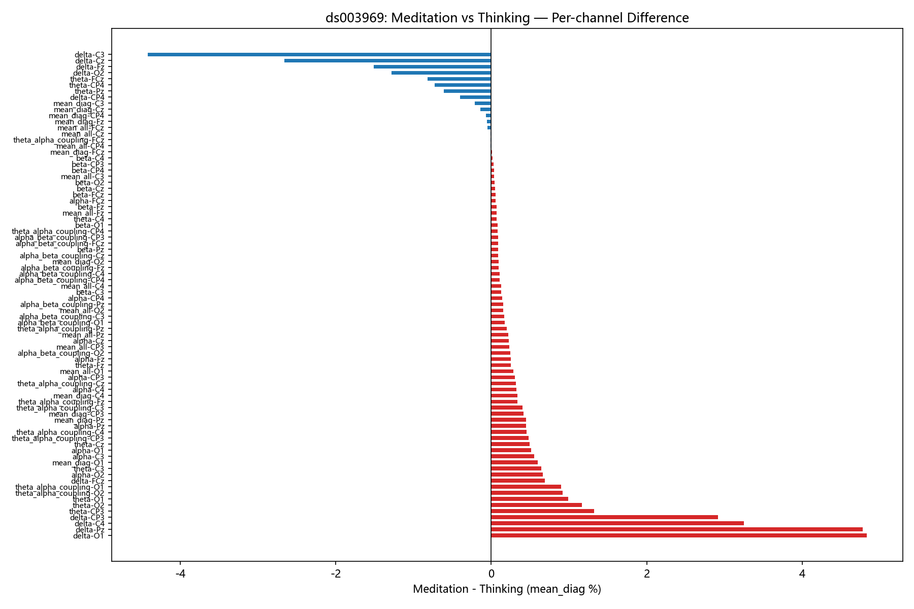

# EEG 双相干性冥想分析（EEG Bicoherence Meditation Analysis）

基于 **C#（.NET Framework 4.8）** 实现的 EEG 双谱 / 双相干性（bispectrum / bicoherence）分析管线，
配套 Python 统计与可视化脚本，用于探究**冥想状态对 EEG 非线性相位耦合的影响**。

分析数据全部来自 OpenNeuro 公开数据集（CC0 许可，详见[数据来源](#数据来源)）。

## 核心结论

跨两个独立公开数据集的统一分析（ds001787 探针范式：12 名资深冥想者 / 6,432 epochs；ds003969 Block 设计：10 名被试 / 24,936 epochs），
**未发现冥想状态对双相干性具有显著且可重复的影响**。详见
[完整分析报告](results/final_report_figures/bicoherence_analysis_report.md)。



## 功能特性

- **信号管线**：BDF 读取（Biosemi 24-bit，自研 BdfReader）→ 去直流 → 1–45 Hz 带通滤波 → Welch 分段双谱计算
  （Nfft = 512，50% 重叠，Hanning 窗）→ 双相干性归一化（N³·σ³，Haubrich 1965）
- **特征提取**：δ/θ/α/β/γ 频段对角双相干 + θ-α / α-β 跨频段耦合
- **三种分析模式**：
  1. 刺激前窗口分析 — 按 Q1 冥想深度评分（2/4/8）分组，输出含 Q1 列的 CSV
  2. Block 设计全录音 20 s 滑窗 — Meditation vs Thinking 条件分组
  3. 通用滑窗 — 任意 BDF 文件快速分析
- **统计验证**：Surrogate 显著性检验、伪迹检测（ArtifactDetector）
- **批量分析 GUI**：WinForms + ScottPlot 2D + WebView2 / ECharts 3D 曲面图
- **Python 工具**：epoch 级双相干趋势图、组水平统计检验

## 目录结构

```
├── code/
│   ├── BicoherenceAnalyzer/        # 核心计算管线 + CLI（net48）
│   ├── BicoherenceViewer/          # 批量分析 GUI（WinForms，net48）
│   ├── WebView2Plots/              # WebView2 + ECharts 3D 可视化类库
│   ├── epoch_spectral_scroll.py    # 双相干趋势图生成（读 expert_epochs_metrics.csv）
│   ├── _batch_stats.py             # 组水平统计（配对 t 检验）
│   └── _download_ds003969.py       # 公开数据集 ds003969 下载脚本
├── results/
│   ├── final_report_figures/       # 最终分析报告（Markdown）+ 精选图表
│   ├── bicoherence_research_report/# 研究报告文本
│   └── expert_epochs/
│       └── expert_epochs_metrics.csv   # epoch 级双相干指标（核心数据）
├── Changes_in_Electroencephalographic_Bicoh.pdf   # 参考论文
├── md2pdf.config.json              # Markdown → PDF 样式配置
└── 导出PDF.bat                      # 一键导出仓库内所有 .md 为 PDF
```

## 数据来源

本项目全部 EEG 数据来自 **OpenNeuro 公开数据集**（均为 **CC0** 许可，可自由获取、分析与再发布）。
原始 BDF 数据体积较大（合计约 12 GB），未包含在本仓库中。

| 数据集 | 实验范式 | 被试 | 本项目分析范围 | 来源与 DOI |
|---|---|---|---|---|
| **ds001787**<br>*EEG meditation study* | 冥想探针范式：持续冥想中约每 2 分钟被提示报告冥想深度（Q1 评分 2 / 4 / 8） | 24 名（12 名资深冥想者 + 12 名新手） | 资深冥想者（expert）组 12 名，共 6,432 个分析窗口 | [OpenNeuro](https://openneuro.org/datasets/ds001787)<br>`doi:10.18112/openneuro.ds001787.v1.1.1` |
| **ds003969**<br>*Meditation vs thinking task* | Block 设计：冥想与思考区段交替（med1breath / med2 / think1 / think2） | 98 名（多种冥想传统 + 对照组） | 前 10 名被试（sub-001 ~ sub-010），共 24,936 个分析窗口 | [OpenNeuro](https://openneuro.org/datasets/ds003969)<br>`doi:10.18112/openneuro.ds003969.v1.0.0` |

### 数据获取

```powershell
# ds003969 — 使用仓库自带下载脚本（OpenNeuro S3 直连、无需认证）
python code\_download_ds003969.py

# ds001787 — 通过 OpenNeuro 官方渠道获取：
#   ① 网页直接下载：https://openneuro.org/datasets/ds001787
#   ② 或使用 openneuro-py：openneuro-py download --dataset ds001787
# 数据放置到项目根目录，保持 BIDS 结构（sub-*/ses-*/eeg/*.bdf + *.tsv / *.json）
```

### 引用

若本仓库的管线或结论对你有帮助，请同时引用数据集对应的原始研究：

1. Brandmeyer T, Delorme A. *Reduced mind wandering in experienced meditators and associated EEG correlates.*
   Experimental Brain Research, 2016. PMID: [27815577](https://pubmed.ncbi.nlm.nih.gov/27815577/) — 对应 ds001787
2. Braboszcz C, Cahn BR, Levy J, Fernandez M, Delorme A. *Increased Gamma Brainwave Amplitude Compared to
   Control in Three Different Meditation Traditions.* PLOS ONE 12(1): e0170647, 2017.
   DOI: [10.1371/journal.pone.0170647](https://doi.org/10.1371/journal.pone.0170647) — 对应 ds003969

## 复现指南

### 1. 环境准备

| 组件 | 要求 |
|---|---|
| 操作系统 | Windows 10 / 11 |
| 运行时 | .NET Framework 4.8 |
| 构建工具 | .NET SDK 或 Visual Studio 2022 |
| Python | 3.9+（pandas / numpy / matplotlib / scipy） |

### 2. 获取数据

见上文[数据获取](#数据获取)：ds003969 用脚本一键完成；ds001787 从 OpenNeuro 下载后放入项目根目录。

### 3. 构建程序

```powershell
# 核心计算 + CLI
dotnet build code\BicoherenceAnalyzer\BicoherenceAnalyzer.csproj -c Release

# 批量分析 GUI（连带构建 WebView2Plots）
dotnet build code\BicoherenceViewer\BicoherenceViewer.csproj -c Release
```

依赖说明：NuGet 自动恢复（MathNet.Numerics、ScottPlot、Microsoft.Web.WebView2）；
SeeSharpTools 系列 DLL 已随仓库包含在 `code\*\lib\` 目录，无需额外安装。

### 4. 运行分析（命令行）

```powershell
$exe = "code\BicoherenceAnalyzer\bin\Release\net48\BicoherenceAnalyzer.exe"

# ① ds001787 资深冥想者组全量批处理 → 重建 results/expert_epochs/expert_epochs_metrics.csv
& $exe --datadir <项目根目录> --all-expert

# ② ds003969 冥想 vs 思考 Block 分析 → 重建 results/ds003969_block_analysis/
& $exe --datadir <项目根目录> --external-ds <项目根目录>\external_data\ds003969 --all-external

# ③ 生成各被试各通道的双相干趋势图 → results/spectral_scrolls/
python code\epoch_spectral_scroll.py --all-expert
```

完整参数说明：`& $exe --help`

### 5. 图形界面（可选）

```powershell
code\BicoherenceViewer\bin\Release\net48\BicoherenceViewer.exe
```

GUI 支持三种分析模式（刺激前窗口 Q1 分组 / Block 滑窗 Med-Think 分组 / 通用滑窗），
并提供结果表格查看、导出与 3D 双相干曲面图。

## 报告导出

`导出PDF.bat` 可将仓库内所有 Markdown（含分析报告）导出为 PDF，
依赖 Node.js 的 [md-to-pdf](https://www.npmjs.com/package/md-to-pdf)：

```powershell
npm install -g md-to-pdf
.\导出PDF.bat
```

## 参考

- 算法参考：*Changes in Electroencephalographic Bicoherence During Sevoflurane Anesthesia*
  （`Changes_in_Electroencephalographic_Bicoh.pdf`）
- 双谱估计与归一化方法：Welch 分段平均 + N³·σ³ 归一化（Haubrich, 1965）
