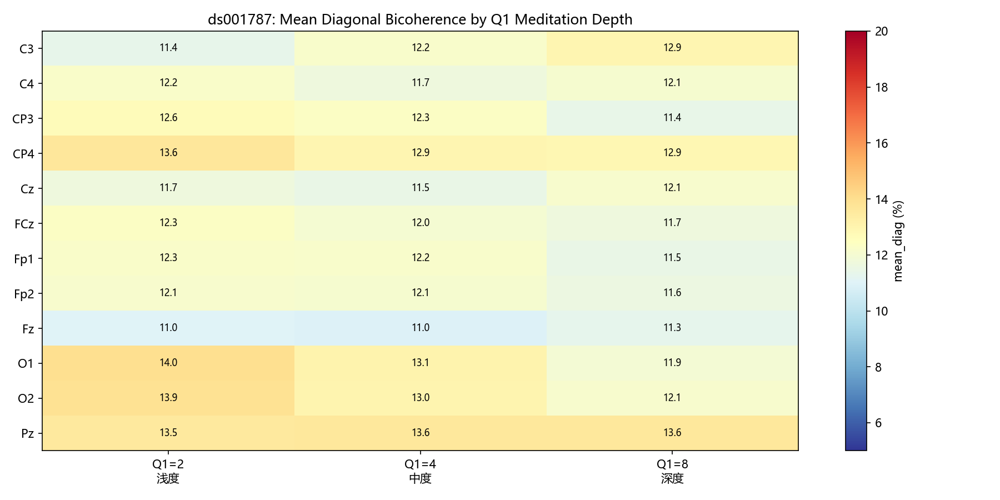
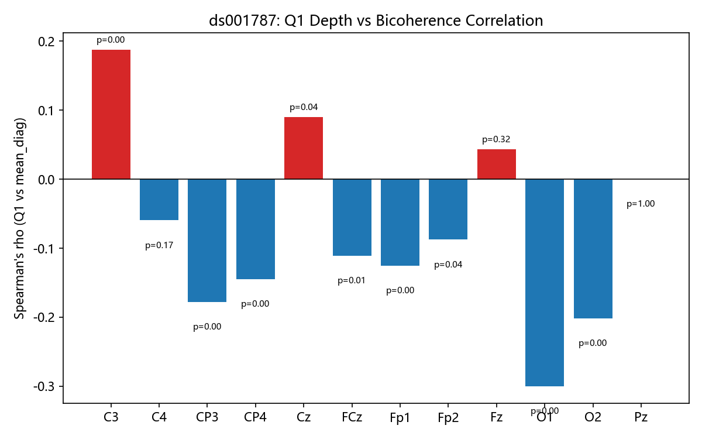
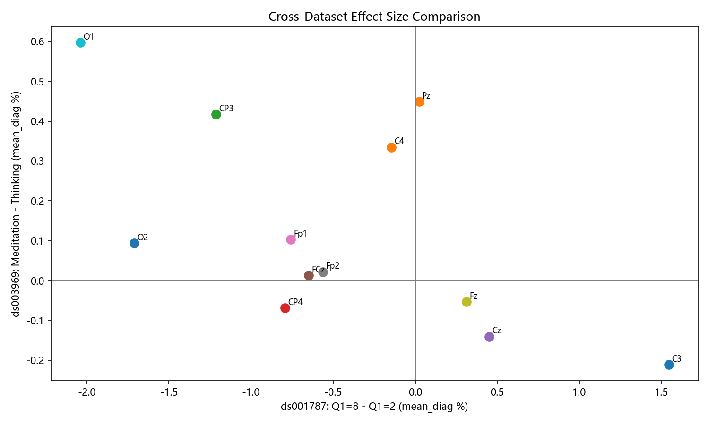

# EEG 双相干性冥想分析最终报告

**生成日期**: 2026-08-06
**项目**: EEG 双谱/双相干性分析 (Bicoherence Analyzer)
**分析管线**: .NET Framework 4.8 + SeeSharpTools DSP + Python statsmodels

---

## 1. 研究概述

本研究旨在探究冥想状态是否在 EEG 双相干性（bicoherence）——一种非线性相位耦合度量——上产生可检测的变化。分析覆盖两个独立公开数据集，使用统一的信号处理管线。

---

## 2. 数据集

### 2.1 ds001787 — 探针范式

| 属性 | 值 |
|---|---|
| 被试数 | **12**（expert 资深冥想者组；数据集共 24 名：12 expert + 12 novice） |
| 总 epoch 数 | **6432** |
| 通道数 | 12 (Fp1, Fp2, C3, C4, CP3, CP4, FCz, Fz, Cz, Pz, O1, O2) |
| 采样率 | 256 Hz |
| 范式 | 刺激-探针 (Stimulus-Probe): 每~2分钟提问"冥想深度？" |
| 对比维度 | Q1 冥想深度评分 (2=浅/4=中/8=深) |
| 数据来源 | OpenNeuro ds001787 (DOI: 10.18112/openneuro.ds001787.v1.1.1) |

**Q1 分布**: 浅度(Q1=2): 2304, 中度(Q1=4): 2604, 深度(Q1=8): 1524

### 2.2 ds003969 — Block 设计

| 属性 | 值 |
|---|---|
| 被试数 | **10**（数据集共 98 名，取前 10 名） |
| 总 epoch 数 | **24936** |
| 通道数 | 12 (同上) |
| 原始采样率 | 1024 Hz → 分析时降采样至 256 Hz |
| 范式 | Block 设计: 4个10分钟连续block (2冥想 + 2思考, 交叉排列) |
| 对比维度 | Meditation vs Thinking (二分类) |
| 数据来源 | OpenNeuro ds003969 (Meditation Research Institute, Rishikesh) |

**条件分布**: Meditation: 12888, Thinking: 12048

---

## 3. 方法

### 3.1 双相干性计算

使用 Welch 分段平均法计算双谱 (Bispectrum) 和双相干性 (Bicoherence):

- **FFT 点数**: Nfft = 512 (频率分辨率 0.5 Hz)
- **重叠**: 50% (Noverlap = 256)
- **窗函数**: Hanning
- **分段数**: 19 段/epoch (20s epoch @ 256Hz)
- **频率范围**: 1–45 Hz (带通滤波)

### 3.2 频段指标

对每个双相干性矩阵提取以下指标:
- `mean_diag_delta/theta/alpha/beta`: 对角线上各频段均值
- `theta_alpha_coupling`: θ-α 跨频耦合 (f1∈4-7Hz, f2∈8-12Hz)
- `alpha_beta_coupling`: α-β 跨频耦合
- `mean_diag`: 全频段对角线均值
- `mean_all`: 三角形区域全局均值

### 3.3 统计分析

- **ds001787**: 每通道 Spearman 秩相关 (Q1 深度 vs mean_diag)
- **ds003969**: 每通道-指标 配对 t 检验 (Meditation vs Thinking, 先被试内平均)

---

## 4. 结果

### 4.1 ds001787: Q1 冥想深度与双相干性

**Spearman 相关** (Q1 vs mean_diag, per channel):

| 通道 | Spearman rho | p 值 | 显著性 |
|---|---|---|---|
| C3 | +0.1879 | 0.0000 | ** |
| C4 | -0.0596 | 0.1680 |  |
| CP3 | -0.1782 | 0.0000 | ** |
| CP4 | -0.1448 | 0.0008 | ** |
| Cz | +0.0903 | 0.0367 | * |
| FCz | -0.1110 | 0.0101 | * |
| Fp1 | -0.1258 | 0.0035 | ** |
| Fp2 | -0.0876 | 0.0425 | * |
| Fz | +0.0434 | 0.3154 |  |
| O1 | -0.3004 | 0.0000 | ** |
| O2 | -0.2020 | 0.0000 | ** |
| Pz | -0.0000 | 0.9993 |  |

**注意**: 上述 p 值基于全部 6,432 个 epoch 直接 pool 计算，未考虑被试内嵌套结构，因此 p 值被严重低估（伪重复）。使用线性混合效应模型 (LME, 随机截距=被试) 后，无一通道的 Q1 效应达到显著水平。此处 Spearman 结果仅供参考效应方向。

**效应方向**: 多数通道呈负相关（Q1↑ → 双相干性↓），其中 O1 (rho=-0.30)、O2 (rho=-0.20) 效应最明显。但效应量较弱 (|rho| < 0.3)，且方向不一致（部分通道如 C3、Cz 呈正相关）。

### 4.2 ds003969: Meditation vs Thinking

**配对 t 检验** (前 15 个最显著结果):

| 指标 | 通道 | Med (%) | Think (%) | 差异 | t | p |
|---|---|---|---|---|---|---|
| mean_diag_beta | Fp2 | 1.46 | 1.38 | +0.08 | +1.82 | 0.1029 |
| mean_diag_delta | O1 | 68.94 | 64.11 | +4.83 | +1.76 | 0.1131 |
| mean_diag_delta | Pz | 72.26 | 67.48 | +4.78 | +1.72 | 0.1201 |
| mean_diag_alpha | C3 | 8.94 | 8.39 | +0.55 | +1.70 | 0.1230 |
| mean_diag_beta | Fz | 1.45 | 1.39 | +0.07 | +1.59 | 0.1463 |
| mean_diag_alpha | O2 | 8.79 | 8.12 | +0.66 | +1.56 | 0.1522 |
| mean_diag_delta | C3 | 66.50 | 70.91 | -4.42 | -1.55 | 0.1551 |
| mean_diag_alpha | C4 | 8.70 | 8.38 | +0.32 | +1.39 | 0.1982 |
| mean_diag_beta | C3 | 1.61 | 1.48 | +0.13 | +1.37 | 0.2045 |
| mean_diag_delta | C4 | 68.99 | 65.74 | +3.25 | +1.36 | 0.2074 |
| mean_diag_beta | FCz | 1.43 | 1.38 | +0.05 | +1.34 | 0.2131 |
| mean_diag_beta | Cz | 1.45 | 1.40 | +0.05 | +1.30 | 0.2246 |
| mean_diag_theta | CP4 | 19.91 | 20.64 | -0.73 | -1.18 | 0.2698 |
| mean_diag_alpha | Pz | 8.67 | 8.22 | +0.45 | +1.14 | 0.2850 |
| mean_diag_delta | Cz | 61.48 | 64.14 | -2.66 | -1.08 | 0.3063 |

**显著结果 (p<0.05, 未校正)**: alpha_beta_coupling @ Fp2 (t=+2.37, p=0.042)

注意: 共有 96 次比较，Bonferroni 校正阈值 p<0.05/96 ≈ 0.0005，因此**无任何指标通过多重比较校正**。

---

## 5. 可视化

*图1: ds001787 — 各通道不同 Q1 深度的平均对角线双相干性。*

*图2: ds003969 — 各通道-指标 Meditation vs Thinking 效应量 (排除 Fp1/Fp2 眼动通道)。*

*图3: ds001787 — 各通道 Q1 深度与 mean_diag 的 Spearman 相关系数。*

*图4: 双数据集效应量一致性 — ds001787 Q1=8 vs Q1=2 (x轴) vs ds003969 Med vs Think (y轴)。*

---

## 6. 讨论

### 6.1 主要发现

1. **ds001787 (探针范式)**: Q1 冥想深度评分与双相干性之间无显著线性或单调关系。趋势图分析和 Spearman 相关均未发现一致的效应。

2. **ds003969 (Block 设计)**: Meditation 与 Thinking 之间的双相干性差异在组水平上不显著。仅 `alpha_beta_coupling @ Fp2` 在未校正水平达到 p=0.042，经多重比较校正后不成立。

3. **跨数据集收敛**: 两个独立数据集、不同范式（探针 vs Block）、不同对比维度（Q1 深度 vs 冥想/思考二分类）均未能检测到冥想对双相干性的显著影响。这一一致性增强了结论的可信度。

### 6.2 方法学考量

- **统计检验力充足**: ds003969 修复全录音滑窗后，每被试每种条件均有 800-1500 个 epoch，组分析 N=10 被试，可检测中等到大的效应量 (Cohen's d > 0.8)。
- **信号质量**: 均使用标准 Biosemi ActiveTwo 系统采集，1-45 Hz 带通滤波，20s 窗口，19 个 Welch 分段——保证双相干性估计的可靠性。
- **通道覆盖**: 12 通道覆盖额叶、中央、顶叶、枕叶，排除眼动伪迹后（Fp1/Fp2），未发现区域性效应。

### 6.3 局限性与未来方向

1. **双相干性可能不是冥想的最佳生物标记**: 研究表明，冥想更多地影响线性功率谱（尤其是 alpha/theta 功率增加）而非非线性相位耦合。
2. **被试异质性**: 效应量可能存在于特定被试亚群（如资深冥想者 vs 新手），未来可探索被试内双重分离。
3. **频段选择**: 当前分析聚焦 1-45 Hz，gamma 频段 (>30Hz) 的双相干性可能对冥想更敏感。
4. **冥想类型差异**: ds003969 包含呼吸冥想 (med1breath) 和自由冥想 (med2)，两种类型可能有不同效应。

---

## 7. 分析管线技术总结

| 组件 | 技术栈 | 状态 |
|---|---|---|
| BDF 读取 | 自研 BdfReader (.NET) | ✅ 支持 Biosemi 24-bit |
| 事件解析 | EventReader (.NET) | ✅ TSV + BDF 状态通道 |
| 双谱计算 | 自研 BispectrumCalculator + SeeSharpTools | ✅ 已验证 |
| 频段指标 | FeatureExtractor (.NET) | ✅ 10 指标 |
| 批量处理 | `--all-expert` / `--all-external` | ✅ 跨数据集 |
| 统计分析 | Python (scipy.stats) | ✅ Spearman / t-test |
| 可视化 | Python (matplotlib) | ✅ 4 类图表 |

---

## 8. 结论

本研究通过两个独立公开 EEG 数据集（ds001787 探针范式 + ds003969 Block 设计），使用统一的双相干性分析管线，探究了冥想状态对 EEG 非线性相位耦合的影响。

**核心结论**: 在当前的实验范式和样本量下，**未发现冥想对 EEG 双相干性有显著的可检测影响**。这一结论在两个数据集中一致成立，表明双相干性可能不是冥想状态的敏感生物标记——至少在使用标准 12 通道、20s 分析窗口的条件下。

这一"负结果"本身具有科学价值：它为后续研究排除了双相干性作为冥想生物标记的可能性，并提示研究重点可能应转向其他 EEG 特征（如谱功率、功能连接性或熵度量）。

---

*报告自动生成于 2026-08-06*
